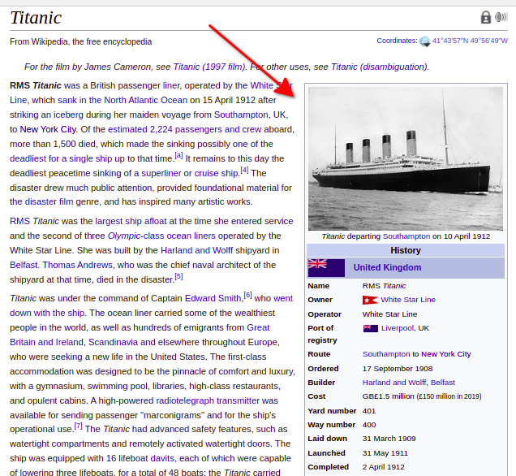
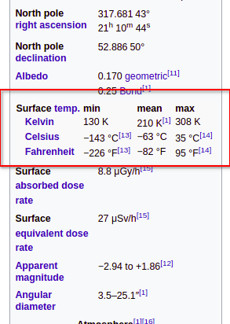

# WikipediaQL showcase: Infoboxes handling

Infoboxes are structured parts of Wikipedia pages, usually in the top right corner:



As of now (Feb 2022) WikipediaQL doesn't provide any infobox-specific selectors/features, and instead we made sure that our [table parsing capabilities](../Tables.md) are powerful enough to extract data with simple queries.

A few examples and quirks below.

## Simple infobox

From [Tilda Swinton](https://en.wikipedia.org/wiki/Tilda_Swinton)'s page (here and everywhere, the output is YAML as the most visual, `--output-format json` works too):

```
$ wikipedia_ql -p "Tilda Swinton" 'table.infobox >> table-data >> td >> { @row as "title"; text as "value" }'

- "value": >-
    Swinton at the 2018 Vienna International Film Festival
- "value": >-
    Swinton at the 2018 Vienna International Film Festival
- "title": >-
    Born
  "value": >-
    Katherine Matilda Swinton

     (1960-11-05) 5 November 1960 (age 61)
    London, England
- "title": >-
    Education
  "value": >-
    New Hall, Cambridge (BA)
- "title": >-
    Occupation
  "value": >-
    Actress
- "title": >-
    Years active
  "value": >-
    1984–present
```

### Fetching only one necessary value

```
$ wikipedia_ql -p "Tilda Swinton" 'table.infobox >> table-data >> td[row="Born"]'

- >-
  Katherine Matilda Swinton

   (1960-11-05) 5 November 1960 (age 61)
  London, England
```

### Non field-value data from the infobox

Note that in the example above there is a title-less cell at the beginning of the output. It corresponds to infobox's header image. If you need only that, you don't even need something like table-data:

```
$ wikipedia_ql -p "Tilda Swinton" 'table.infobox >> .infobox-image >> { img@src; .infobox-caption }'

- >-
  https://upload.wikimedia.org/wikipedia/commons/thumb/b/b8/Viennale_2018_Suspiria_15_Tilda_Swinton_%28cropped%29.jpg/220px-Viennale_2018_Suspiria_15_Tilda_Swinton_%28cropped%29.jpg
- >-
  Swinton at the 2018 Vienna International Film Festival
```

## Infoboxes with sections

[Mars](https://en.wikipedia.org/wiki/Mars) has mid-table headers in the infobox ("Designations", "Orbital characteristicts", "Physical characteristics" and so on). `table-data` linearizes them, attaching to the subsequent row headers:

```
$ wikipedia_ql -p "Mars" 'table.infobox >> table-data >> td >> { @row as "title"; text as "value" }'

...
- "title": >-
    Designations
    Pronunciation
  "value": >-
    /ˈmɑːrz/ (listen)
- "title": >-
    Designations
    Adjectives
  "value": >-
    Martian (/ˈmɑːrʃən/)
- "value": >-
    Epoch J2000
- "title": >-
    Orbital characteristics
    Aphelion
  "value": >-
    249200000 km
    (154800000 mi; 1.666 AU)
- "title": >-
    Orbital characteristics
    Perihelion
  "value": >-
    206700000 km
    (128400000 mi; 1.382 AU)
...
```

This also allows to easily fetch only some part of data by the attached prefix:

```
$ wikipedia_ql -p "Mars" 'table.infobox >> table-data >> td[row^="Designations"] >> { @row as "title"; text as "value" }'

- "title": >-
    Designations
    Pronunciation
  "value": >-
    /ˈmɑːrz/ (listen)
- "title": >-
    Designations
    Adjectives
  "value": >-
    Martian (/ˈmɑːrʃən/)
```


## Legacy `th`-less infoboxes

[Titanic](https://en.wikipedia.org/wiki/Titanic) has infobox that looks regularly but actually row-level headers imitated with bold font. Use `:force-row-headers(1)` to make WikipediaQL consider first column a row title anyway:

```
$ wikipedia_ql -p "Titanic" 'table.infobox >> table-data:force-row-headers(1) >> td >> { @row as "title"; text as "value" }'

...
- "title": >-
    United Kingdom
    Name
  "value": >-
    RMS Titanic
- "title": >-
    United Kingdom
    Owner
  "value": >-
    White Star Line
...
- "title": >-
    General characteristics
    Class and type
  "value": >-
    Olympic-class ocean liner
- "title": >-
    General characteristics
    Tonnage
  "value": >-
    46,328 GRT
...
```
(Note "United Kingdom" mid-table header became a prefix of rows below it, which in this particular case isn't really meaningful... but that's how it is formatted. The "General characteristics" header becoming prefix is more logical.)

## Several infoboxes on a page

If we'll try to apply the same approach to, say, [Thailand](https://en.wikipedia.org/wiki/Thailand) page, we'll have the data from the infobox just OK, but also we'll have some `title`-less data in the end:

```
$ wikipedia_ql -p "Thailand" 'table.infobox >> table-data >> td >> { @row as "title"; text as "value" }'

...
- "title": >-
    Capital and largest city
  "value": "Bangkok\n13°45′N 100°29′E\uFEFF / \uFEFF13.750°N 100.483°E\uFEFF / 13.750; 100.483"
- "title": >-
    Official languages
  "value": >-
    Thai
- "title": >-
    Spoken languages
...
- "value": >-
    Poverty
- "value": >-
    8.61%  (2016)
- "value": ""
- "value": >-
    Net household worth
- "value": >-
    ฿20.34 trillion  (2010)
...
```
Those values in the end is not from the main infobox! `.infobox` HTML class is used in Wikipedia liberally for formatting, so the second one—and differently structured—is in the "[Economy](https://en.wikipedia.org/wiki/Thailand#Economy)" section.

It would be more useful to fetch them separately:

First, use `section:first` to address only page-top infobox:

```
$ wikipedia_ql -p "Thailand" 'section:first >> table.infobox >> table-data >> td >> { @row as "title"; text as "value" }'

- "title": >-
    Population

    ISO 3166 code
  "value": >-
    TH
- "title": >-
    Population

    Internet TLD
  "value": >-
    .th

    .ไทย
```
(Note that "Population" mid-table section is wrongly prefixed to every cell below... That's the short-coming we are planning to overcome one way or another.)

And then fetch Economy infobox, forcing its first cell to be treated as a header:

```
$ wikipedia_ql -p "Thailand" 'section[heading="Economy"] >> table.infobox >> table-data:force-row-headers(1) >> td:first-child >> { @row as "title"; text as "value" }'

- "title": >-
    Nominal GDP
  "value": >-
    ฿14.53 trillion  (2016)
- "title": >-
    GDP growth
  "value": >-
    3.9%  (2017)
- "title": >-
    Inflation • Headline • Core
  "value": >-
    0.7%  (2017)

    0.6%  (2017)
- "title": >-
    Employment-to-population ratio
  "value": >-
    68.0%  (2017)
```
(We need only `td:first-child` to skip on the third column with data reference links.)

## Complex structures embedded in infoboxes

Not all infoboxes are structured in "field"-"value" way. Sometimes you need to dig deeper to extract some data properly. For example, on the [Mars](https://en.wikipedia.org/wiki/Mars) page, there is a temperature table in the middle:



It can be extracted separately:
```
$ wikipedia_ql -p "Mars" 'table.infobox >> .infobox-full-data >> table >> table-data >> td >> { @column as "col"; @row as "row"; text as "value" }'

- "col": >-
    min
  "row": >-
    Kelvin
  "value": >-
    130 K
- "col": >-
    mean
  "row": >-
    Kelvin
  "value": >-
    210 K
- "col": >-
    max
  "row": >-
    Kelvin
  "value": >-
    308 K
- "col": >-
    min
  "row": >-
    Celsius
  "value": >-
    −143 °C
...
```

**Consider this example, though, to know there is no generic way to parse _any_ infobox on a previously uninvestigated page with generic statement. That's the principal limitation of the table-based approach.** Therefore we aren't ruling out the possibility to add some infobox-specific functionality in the future.
